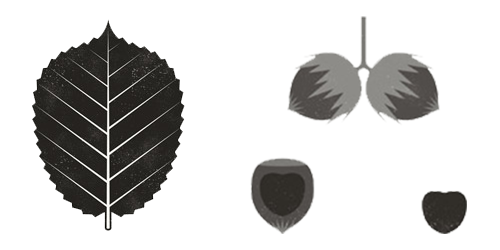

---
disablearabicstart: true
lang: de-DE
forceimages: true
force-image-position: true
link-citations: true
lof: true
lot: true
...

\pagenumbering{roman}
\setcounter{page}{5}

\section*{Vorwort}
\addcontentsline{toc}{section}{Vorwort}
\markright{Vorwort}

Als Pfadfinderprobenhilfe beansprucht dieses Werk keinen Anspruch auf Vollständigkeit oder absolute Aktualität. Vielmehr kann es als ergänzendes Mittel zu bereits vorhandenen Werken wie dem 'Sippenführer', alten Probenheften oder Schulungskladden verwendet werden. Als Sippenführer ist es immer wichtig, einen individuellen Sippenabend zu gestalten. Deswegen sind Aufzeichnungen wie diese als Orientierung, nicht aber als fertiger Sippenabend, anzuwenden. An dieser Stelle sei in aller Deutlichkeit darauf hingewiesen, dass Sipplinge Inhalte am besten verstehen, wenn sie kreativ aufbereitet werden. Deswegen lohnt es sich als Sippenführer, einen Moment zu nehmen, um eine spannende Probenarbeit vorzubereiten. Gegebenenfalls kann auch die Sammlung für kreatives Sippenabendprogramm behilflich sein.

Diese Pfadfinderpobenhilfe ist angelehnt an die Proben des 'Sippenführers' und die Pfadfinderprobenordnung der Stammesordnung und vereint vorherige Pfadfinderprobenhilfen von Nils & Stefan Langhein. Sie wurde 2020 von Fabian Forthmann ergänzt und aktualisiert. Die Pfadfinderprobenordnung befindet sich in der aktuellen Ausgabe des 'Sippenführers' auf den Seiten 98 & 99 und in der Stammesordnung. In dieser Probenhilfe wird sich auf die *4. Auflage des 'Sippenführers' von 1998* bezogen. Wegen der Nutzung von Urheberrechtlich geschützten Inhalten, ist diese Probenhilfe ausschließlich für den internen Gebrauch vorgesehen.

&nbsp;

\underline{Bedingungen zur Aufnahme als Pfadfinder}

„Nach Erfüllung aller Pfadfinderproben kann man frühestens drei Monate nach der Jungpfadfinderaufnahme Pfadfinder werden, wenn man mindestens 10 Jahre alt ist. Ein Pfadfinder sollte über umfangreiches Pfadfinderwissen verfügen und sich in seiner Sippe und auf Fahrt zurechtfinden. Er soll bereits weitgehend selbstständig sein und an Sippenarbeiten und auf Fahrten Aktivitäten mitgestalten können. Bei der Aufnahme wird eine Anstecknadel verliehen.“\
*(Siehe Stammesordnung, Seite 9 oder 'Der Sippenführer', Seite 99)*

&nbsp;

\underline{Das Pfadfinderversprechen}

'Im Vertrauen auf Gottes Hilfe verspreche ich, die Aufgaben des Pfadfinders als Mitgestalter des Sippenlebens zu erfüllen.'

\pagebreak

\pagenumbering{arabic}

# Christentum

Als christliche Pfadfinder hat es für uns eine besondere Bedeutung, unseren Sipplingen den Charakter Gottes nahezubringen. Als 'Mitgestalter des Sippenlebens' ist es als Pfadfinder besonders wichtig, bekannte christliche Inhalte zu kennen und zu verstehen. Ziel der Christlichen Pfadfinderschaft seit 1921 ist es, aus jungen Menschen mündige Christen zu machen.

## Du kannst das Vater Unser und die Zehn Gebote

*Es ist sinnvoll, diese Probe nicht nur auf das Auswendiglernen beider Textstellen zu reduzieren. Wichtiger als die Bibelstellen zu kennen ist es, dass die Sipplinge das Vaterunser und die Zehn Gebote inhaltlich verstehen und nachvollziehen können. Für ein tieferes Verständnis beider Bibelstellen ist es sinnvoll, sie nach und nach durchzugehen und zu erläutern. Außerdem ist es immer verständnisfördernd, den historischen und biblischen Hintergrund solcher Inhalte zu erklären.*

&nbsp;

**Vaterunser[^footnote1]:**

Vater unser im Himmel,\
geheiligt werde Dein Name.\
Dein Reich komme.\
Dein Wille geschehe,\
wie im Himmel, so auf Erden.\
Unser tägliches Brot gib uns heute.\
Und vergib uns unsere Schuld,\
wie auch wir vergeben unsern Schuldigern.\
Und führe uns nicht in Versuchung,\
sondern erlöse uns von dem Bösen.\
Denn Dein ist das Reich\
und die Kraft und die Herrlichkeit\
in Ewigkeit.\
Amen.

[^footnote1]: Anders als das Glaubensbekenntniss ist das Vaterunser konfessionsübergreifend identisch, weil Jesus es seinen Jüngern in **Matthäus 6, 9-13** selber 'beigebracht' hat. Jesus gibt dieses Gebet im Kontext von 'richtigem' Beten an seine Jünger weiter. Deswegen ist es sicherlich sinnvoll, sich den Kontext in *Matthäus 6, 5-15* anzugucken.

\pagebreak

**Zehn Gebote[^footnote2]:**

1. Du sollst keine anderen Götter haben neben mir
2. Du sollst dir kein Bildnis von Gott machen 
3. Du sollst den Namen Gottes nicht missbrauchen
4. Du sollst den Feiertag heiligen
5. Du sollst deine Eltern ehren
6. Du sollst nicht töten
7. Du sollst nicht ehebrechen
8. Du sollst nicht stehlen
9. Du sollst nicht lügen
10. Du sollst nicht neiden 

*Stark vereinfachte Form aus der Bibel (2. Mose 20, 2-17).*

[^footnote2]: Die Zehn Gebote sind vor allem Ausdruck des alten Bunds zwischen Gott und den Menschen im Alten Testament. Bevor Jesus für uns geopfert wurde, mussten sich die gläubigen Juden an viele Gesetze halten und eigene Opfer bringen, um weniger schuldig vor Gott zu sein. Um die Zehn Gebote im Kontext des neuen Bunds zwischen Gott und den Menschen seit der Kreuzigung und Wiederauferstehung Jesu zu sehen, ist es sinnvoll, sich die Geschichte vom höchsten Gebot in *Matthäus 22, 34-40* anzusehen oder die Ostergeschichte revue passieren zu lassen. 

\pagebreak

## Du hältst eine Andacht mit einem Sippenführer oder einer anderen Person

Die Andacht ist ein fester Bestandteil der Fahrt und bietet dort neben persönlichen Gesprächen die beste Grundlage etwas über das Evangelium zu erzählen. Eine erfolgreiche Andacht lebt neben einer guten Vorbereitung und einer Prise Gott vor allem von persönlichen Eindrücken und kreativen Darstellungen von Bibelstellen. *Ideen für Andachtsthemen aller Altersstufen finden sich im Sippenführer auf Seite 12 oder im C-Konzept.*

&nbsp;

\underline{Eine Andacht hat folgende Bestandteile:}

* Vorbereitung
    * Thema & passende Bibelstellen auswählen
    * Wichtige Kernbotschaften identifizieren und über kreative Gestaltung nachdenken
    * Mit anderen Ulanen über das Thema austauschen und Gott mit einbeziehen
    * Reinschrift anfertigen, Lieder f.d. Andacht auswählen und ggf. Requisiten besorgen
* Beginn der Andacht mit einem gemeinsamen Gebet (evtl. auch zusätzlich mit einem Lied)
* Verkündigung
* Stille Zeit und Anbetung 
* Lobpreis (z.B. durch Lieder an unterschiedlichen Stellen) 
* Segen oder Abschlussgebet

\pagebreak

\underline{Zur inhaltlichen Gestaltung einer Andacht kann folgendes Schema verwendet werden:}

Zuerst wird ein Thema anhand einer Bibelstelle ausgewählt, auf welches die Andacht zuläuft. Daraufhin muss für die Reinschrift Struktur geschaffen werden, was man wann und wie in dem Verkündigungsteil der Andacht sagt.

**Me**\
*Der Andachtshaltende erläutert das Thema anhand eines persönlichen Einblicks in sein Leben. Wie habe ich das Thema erlebt? Was bedeutet es für mich?*

**We**\
*Der Andachtshaltende bezieht seine persönlichen Erfahrungen und das Thema generell auf die Gruppe. Wieso ist das Thema für die Gruppe wichtig? Wem ist schonmal etwas Ähnliches passiert?*

**God**\
*Nun kommt Gott ins Spiel. Was sagt er und besonders die Bibel zu diesem Thema? Wie unterscheidet sich Gottes Sicht auf das Thema zu unseren Auffassungen?*

**Me**\
*Der Andachtshaltende bezieht die Bibelstelle auf sich selbst und erwähnt eventuell seine Geschichte vom Anfang. Welche Auswirkung hat die Bibelstelle auf mein Leben? Wie ändert Gottes Sicht dieser Situation mein Verhalten?*

**We**\
*Nun wird die Bibelstelle auf die ganze Gruppe bezogen. Welche Veränderungen können eintreten, wenn wir als Gruppe in diesem konkreten Fall von Gott lernen?*

**You**\
*Die Bibelstelle wird auf jeden einzelnen Zuhörer bezogen. Was kann sich in Deinem Leben verändern, wenn Du in diesem Punkt von Gott lernst? Glaube ist zwar etwas gemeinschaftliches, braucht aber eine persönliche Entscheidung.*

\pagebreak

## Du besuchst mit Deiner Sippe einen Gottesdienst oder eine andere christliche Veranstaltung

Diese Probe muss individuell durchgeführt werden und bedarf keiner theoretischen Betrachtung. Trotzdem ist wichtig zu verstehen, dass viele Kinder von Haus aus nicht mehr die Kirche besuchen. Deswegen ist es wertvoll, ihnen ein solches Umfeld nahezubringen. Je nach Alter der Sipplinge und Komplexität der Predigt, sollte der Gottesdienst oder die christliche Veranstaltung im Nachgang nochmal besprochen werden.

\pagebreak

# Pfadfindertum

Als Pfadfinder sollte man auch den Hintergrund der Pfadfinderbewegung, des eigenen Stammes und der eigenen Sippe verstehen, um weitere Zusammenhänge der weltweiten Pfadfinderschaft und des eigenen Stammes nachvollziehen zu können.

## Du zeichnest die Pfadfinderlilie in Dein Pfadfinderbuch ein und erklärst sie

Die Lilie entstand als Zeichen im Jahre 1140. Sie galt im Mittelalter als Zeichen der Ritterlichkeit und der Höflichkeit. Außerdem ist sie historisch als Zeichen der Orientierung belegt, weil die Lilie in der frühen Seefahrt als Zeichen für die Himmelsrichtungen verwendet wurde. Der Gründer der Pfadfinder, Robert Baden-Powell, verwendete die Lilie das erste Mal als Auszeichnung für herausragende Feldaufklärer. Heute ist sie das Zeichen aller Pfadfinder auf der Welt, die dem Sinnbild der Lilie nacheifern wollen. Das Zeichen der christlichen Pfadfinder ist die Kreuzlilie.

{width=45%}

Die Kreuzlilie beinhaltet als verbindendes Symbol der Lilie das Kreuz, welches für den Glauben der Christlichen Pfadfinder und für die Verbindungswirkung Gottes steht. 

\pagebreak

## Du kennst die stammesinterne Ständeregelung

Stände sind als Teil der Probenarbeit essenziell. Sie zeichnen nicht nur unterschiedliche Wissensstände unter den Sipplingen und Ulanen aus, sondern sind auch ein Weg, Verbindlichkeit und Hierarchien in einer Organisation zu etablieren. Im Folgenden sind die unterschiedlichen Stände des Stammes mit ihren Aufgaben und einzusetzenden Bereichen aufgeführt. Die in der Tabelle genannten Altersspannen beziehen sich auf das typische Alter für den Stand.

&nbsp;

| Alter | Stand | Bereiche | Aufgabe |
|-|---|---|------|
| 8-9  | Wölfling        | Sippe   |    Sippe zugehörig  |
| 9-11 | Jungpfadfinder  | Sippe   |   Grundlegendes Pfadfinderwissen vorhanden   |
| 11-13 | Pfadfinder      | Sippe   |     Sippe aktiv mitgestalten  |
| 13-16 | Knappe          | Sippe & Stamm              |     Sippe hauptverantwortlich leiten  |
| 16-18 | Späher          | Sippe & Stamm |     Stamm führend gestalten  |
| ab 18 | Kreuzpfadfinder | Sippe, Stamm & wahlweise weitere | Christliche Botschaft lebenslang teilen |
|    ab 14  |    Rover |     Stamm   |  Externer Unterstützer  |

  : Zusammengefasste Ständeregelung

\pagebreak

## Du weißt über die Stammessituation bescheid

*Diese Probe **muss** aktuell vorbereitet werden. Es bietet sich an, sie im Anschluss an einen Thing zu machen und die Sipplinge während des Things Notizen machen zu lassen. Zur Stammessituation gehören die Ämterbesetzungen und ein paar weitere Kennzahlen sowie ggf. weitere aktuelle Ereignisse.*

&nbsp;

Zusätzlich zu den gängigen Ämtern kann es auch Beauftragungen geben. Gängige Beauftragungen sind beispielsweise die *Mitgliederverwaltungs-Beauftragung*, die *Seybruch-Beauftragung* oder die *Schulfüchse-Beauftragung*.

&nbsp;

**Ämter:**

| Amt | Aufgabe | Besetzung |
|-------|-------------|----|
|   Stammesführer  |  Leitung & Koordination des Stammes  | ________ |
|  Geschäftsführer  | Verwaltung der Stammesgelder  | ________ |
| Stammesältester | Außenstehender Ansprechpartner bei Problemen | ________ |
|    Materialwart  |  Stammesmaterial (Kohten, Beile, Tampen etc.) | ________ |
| Bürowart | Verkauf & Verwaltung kleinerer Budgets | ________ |
| Speikawart | Speisekammer & Kochutensilien | ________ |
| Musischer Wart | Musische Mittel (Basteln & Musik) | ________ |
| Erste-Hilfe Wart | Medizinische Versorgung  | ________ |
| Werkkammerwart  | Werkkammer | ________ |
| Thinggraf | Einberufung & Durchführung des Things sowie Überwachung der Stammesordnung| ________ |
| Neue Medien Wart |  Website und Ähnliches | ________ |
| Schulfuchs Beauftragter | Verbindung zum Schulprojekt |________ |

  : Vorlage für Ämterbesetzung
  
Außerdem sind folgende Kennzahlen zu besprechen: 

* Anzahl der Stammesmitglieder
* Anzahl der Sippen 

\pagebreak

## Du kannst das Pfadfinderversprechen und besprichst es mit Deinem Sippenführer

*Nun folgt das Pfadfinderversprechen. In der Besprechung des Versprechens lohnt es sich, den Begriff 'Mitgestalter des Sippenlebens' sowie die Redewendung 'Im Vertraun auf Gottes Hilfe' zu vertiefen. Außerdem kann beim Sippenabend ein Vergleich dieses Versprechens mit dem ursprünglichen Pfadfinderversprechen BPs hilfreich sein.*

&nbsp;

\underline{Versprechen:}

**'Im Vertrauen auf Gottes Hilfe verspreche ich, die Aufgaben des Pfadfinders als Mitgestalter des Sippenlebens zu erfüllen.'**

&nbsp;

\underline{Ursprüngliches Pfadfinderversprechen von BP:}

On my honour I promise that I will do my best –

* To do my duty to God and the King (or to God and my Country)
* To help other people at all times
* To obey the Scout Law

\pagebreak

## Du kennst die Stammesgeschichte in ihrern Grundzügen

*Es kann sinnvoll sein, zum tieferen Verständnis und zur besseren Veranschaulichung in der Vorbereitung und beim Sippenabend die Jubiläumsbroschüren der Jubiläen 50 und 70 Jahre Stamm St. Andreas zu verwenden. Dort sind neben detaillierten Beschreibungen auch interessante Fotos vorhanden, die sonst im Stammesarchiv besichtigt werden können. Diese Schilderung ist **Stand Mai 2020**. Alle weiteren wichtigen Ereignisse müssen nach Ermessen des Sippenführers ergänzt werden.*

&nbsp;

Im Folgenden wird die Stammesgeschichte in zwei Formen dargelegt. Einmal in kompakten Stichpunkten und das zweite Mal als detaillierter Fließtext.

&nbsp;

\underline{Stichpunkte}

* Gegründet am 27. März 1949 von dem Theologiestudenten Hartmut Clasen
* Anfang 1950 bereits 20 Mitglieder in 3 Sippen (Eichkatzen, Biber, Hirsche). Später ca. 40 Mitglieder
* Erste Fahrten in nähere Umgebung Hamburgs
* Ab 1957 Kohten in der Sippe Wildgänse
* 1960: erste Krise des Stammes, durch den Weggang der Führung --> Existenz bedroht
* Letzte verbliebende Sippe fährt auf das Bundeslager 1960, aus ihr entstehen 1964 zwei neue Sippen (ab jetzt mit Völkernamen)
* Es folgt eine Zeit mit interessanten Aktionen & Fahrten, vor allem ins Ausland
* Anfang der 70er Jahre droht der Stamm erneut einzugehen (Folge der 68er und der Fusion des CPD mit EMP / BEMP zum VCP in 1971 / 72)
    * Pfadfinderei wurde als veraltet angesehen, lose Aktivitäten und spontane Aktionen ohne Sippencharakter waren die Folge
* 1972 gründet Kai Langhein die Sippe Inka, sie ist der Grundstein für 25 Sippen mit 250 Mitgliedern in den 80er Jahren
* 1981 Gründung der erfolgreichen Herbstschulung
* Bis zu 200 Mitglieder in 24 Sippen --> Hamburgs größter Stamm
* Zahlreiche Auslandssommerfahrten unter anderem nach Island
* 1996 bislang größte Sommerfahrt des Stammes (46 Teilnehmer in Cornwall)
* 1997: Nach Auseinandersetzungen zwischen verschiedenen Gruppen innerhalb der Ulanen spalten sich zwei erfolgreiche Sippenführer ab und gründen den Stamm St. Markus in Hoheluft
* 2004: Nach inhaltlichen Differenzen spaltet sich ein Teil des Stammes ab, danach nur noch 35 Mitglieder. Einige der abgespaltenen Ulanen gründen den Stamm St. Paulus an der Christuskirche
* In der Folge trotz vieler Konkurrenzangebote schnelles Mitgliederwachstum
* 2005: Die Pfadfinder gewinnen eine Pachtausschreibung des Landes Niedersachsen und pachten von nun an das Pfadfindergelände im Seybruch - intensive Renovierungsarbeiten beginnen
* 2011: Jamboree in Schweden mit eigenem St. Andreas Trupp aus 40 Mitgliedern 
* Nach Auseinandersetzungen im VCP über eine VCP-unabhängige Stammesmitgliedschaft der Pfadfinder St. Andreas wird dem Stamm im selben Jahr die VCP-Mitgliedschaft aberkannt und er tritt der EJH bei
* 2013: Gründung des Schulprojekts 'Schulfüchse', das mittlerweile den Großteil der Sipplingsaquise übernimmt
* 2018 eines der größten Pfingstlager der Stammesgeschichte mit ungefähr 130 Teilnehmern
* 2019 feiern die Pfadfinder St. Andreas ihr 70-jähriges Juiläum mit vielen aktiven und ehemaligen Pfadfindern
* Anfang 2020 trennt sich die Kirchengemeinde St. Andreas nach  einem starken, öffentlichen Streit wegen fadenscheiniger Argumente von den Pfadfindern St. Andreas
* Mitte 2020 zählt der Pfadfinderstamm ungefähr 180 aktive Mitglieder aufgeteilt in 20 Sippen

&nbsp;

\underline{Fließtext}

Am 27. März 1949 wurde die Gründungsidee der Pfadfinderarbeit zu St. Andreas geboren. Hartmut Clasen, ein Theologiestudent, war der Begründer dieser Idee. In den Anfängen der 50iger Jahre erlebte die „Siedlung St. Andreas“ einen stetigen Anstieg in der Pfadfinderarbeit: Es wurden 3 Sippen mit insgesamt 20 Mitgliedern gegründet. Dieser Elan hielt zunächst bis zum Ende dieses Jahrzehnts an, flachte danach aber etwas ab. 1957 fand eine neue Mode Einzug in den Fahrten Stil: Ab sofort fuhr man nur noch mit den neuen Kohten auf Fahrt. Außerdem wurden die Pfadinder St. Andreas Mitglieder der CPD.

1960 brach die Arbeit zum ersten Mal fast zusammen. Innere Zerstrittenheit führte dazu, dass alle Sippen aufhörten zu existieren. Auf dem damaligen Bundeslager fanden nur noch wenige ältere Mitglieder zusammen. Dieser Kern hielt sich bis 1964 zusammen. Mehrere zwischenzeitliche Sippenneugründungen scheiterten. 1967 bis 1970 brachten dann wieder mehrere Höhepunkte und große Fahrten in die Stammesarbeit. Die Methode der Pfadfinderarbeit erlebte hier nochmals alle pfadfinderischen Formen in aller Kompromisslosigkeit.

1971 und 1972 verschmolzen CPD und EMP / BEMP zum VPC. Dieser Umbruch des Bundes war auch im Stamm zu spüren. Nahezu alle Traditionen und Arbeitsformen der Pfadfinderarbeit wurden umgestoßen und durch Experimente neuer Formen ersetzt. Die daraus resultierende Unruhe und Zerstrittenheit brachte Jahre des Auseinandergehens und der inneren Zerrüttung. Nur noch die Anfang 1972 gegründete Sippe „Inka“ leistete noch eigentliche Pfadfinderarbeit. Mehrere Teilungen dieser Sippe und allmähliches Auflösen der noch locker bestehenden alten Gruppierungen führten ab 1974 zu einem stetigen Anstieg der Arbeit. Die Kontinuität der Stammesführung und der wieder bessere Gemeindebezug der Arbeit brachte 1976 einen vorläufigen Höhepunkt. 1977 gab es eine erneute Auseinandersetzung um Arbeitsformen, die dann zu einer Abspaltung einer Rovergruppe führte. Mehrere große Fahrten und zunehmende Einflussnahme des Stammes auf den Bezirk Alstergau und das Land Hamburg führten zu immer größerer Stabilität der Arbeit. 

1980 brachte dann auch erneut eine Stärkung der Arbeit. Diese lief parallel zu einer sich immer mehr anbahnenden Auseinandersetzung, die erneut in Land und Bund über die Arbeitsformen geführt wurde. Als einer der stärksten und stabilsten Stämme des Landes wurde der Stamm St. Andreas 1981 Wortführer größerer Umwälzungen im Land Hamburg. Die Achtziger Jahre stellten die bisher erfolgreichste Zeit des Stammes St. Andreas dar. War der Stamm in der ersten Hälfte seiner Geschichte selten größer als 35 Mitglieder, wurde er jetzt mit ungefähr 200 Mitgliedern und 24 Sippen zum einem der größten VCP Stämme. Gleichzeitig entstand Bedarf nach ausreichenden Kapazitäten für die Schulung der Gruppenleiter, so dass 1981 erstmals die heute noch existierende Herbstschulung eingeführt wurde. Das Wachstum des Stammes endete um 1983 / 84, und es gab erneut einen Umbruch. Ältere Sippenführer wurden von jüngeren ersetzt, das Erreichte gefestigt. Mitte bis Ende der 80iger fanden zahlreiche Auslandsfahrten unter anderem nach Frankreich, England, Finnland, Polen, Irland und Island statt. Geprägt war diese Zeit durch einen christlichen Aufbruch, der in einem lebendigen Andachtsstil sichtbar war.

Die Neunziger gehen einher mit zahlreichenden Veränderungen. Trotz allem ist die Arbeit im Stamm von zahlreichen Höhepunkten geprägt. Neben dem Kamerunprojekt, das dortigen Jugendlichen bei der Ausbildung helfen soll, wird Mitte der Neunziger mit dem „Friedenslicht“, aus der Geburtskirche Jesu in Bethlehem, ein weiterer Schwerpunkt unserer Arbeit gesetzt. 1996 findet mit 46 Teilnehmern die erfolgreichste Sommerfahrt der letzten 10 Jahre nach Cornwall statt. Obgleich sich bereits ein weiterer Generationswechsel bei den Sippenführern abzeichnete, war die Arbeit der letzten Jahre von Konsistenz geprägt. 1997 gab es im Stamm Auseinandersetzungen zwischen verschiedenen Gruppen innerhalb der Ulanen, so dass daraus eine Abspaltung entstehen sollte. Zwei sehr erfolgreiche Sippenführer von 2 Sippen verließen mit Ihren Sipplingen den Stamm und gründeten in Hoheluft den Stamm St. Markus.

Die folgenden Jahre verliefen ruhig. Die Sommerfahrtstradition wurde aufrechterhalten und viele Fahrten und Lager wurden organisiert. Der Stamm St. Andreas war Kopf des Bezirkes Alstergau und einflussreich im Landesverband. In dieser Zeit fand ein Generationswechsel im Stamm statt. Viele junge Sippenführer gründeten oder übernahmen Sippen. Leider ging die inhaltliche Arbeit in den folgenden Jahren zurück. Viele Sipplinge verließen den Stamm bevor sie Verantwortung übernehmen konnten, sodass Pfingstlager stattfanden, an denen 50 und weniger Pfadfinder teilnahmen. Sippen wurden gegründet und mangels Sipplingen bald wieder zusammengelegt und viele Sippen hatten oft wechselnde Sippenführer, so daß eine kontinuierliche, gemeinschaftsbezogene Arbeit immer mehr auf dem Rückgang war. 2003 wurden dann erstmalig wieder drei neue Sippen, von motivierten und jungen Sippenführern gegründet, die Jicarillas, Yerbateros und Yakima. Dennoch gab es innerhalb der Ulanen immer wieder Spannungen über pfadfinderische Prinzipien und den christlichen Glauben. Die gemeindebezogene Arbeit wurde mehr und mehr zurückgefahren, so daß der Stamm innerhalb der Kirchengemeinde zunehmend isoliert wurde. Von einer Gruppe der Ulanen wurde 2003 zusammen mit einigen Älteren und der Gemeinde an „ProChrist“ teilgenommen, einem evangelistischen Übertragungsgottesdienst. Die verschiedenen Gruppen innerhalb der Ulanen entfremdeten sich zunehmend, so wurden getrennte Fahrten organisiert, unter anderem unterschiedliche Sommerfahrten für 2004.

Nach einem großen Pfingstlager 2004 zeichnete sich erneut eine Stammesspaltung ab. Nach den Sommerfahrten war es dann soweit: Ca. 12 Ulanen verließen mit ihren Sippen den Stamm St. Andreas, um in der Nachbarschaft an der Christuskirche den Stamm St. Paulus zu gründen. Andere Ulanen hörten mit der Pfadfinderarbeit auf. Übrig blieben 8 junge, motivierte Ulanen, die in den folgenden Jahren eine christlich und pfadfinderisch starke Arbeit aufbauten, so dass sich in wenigen Jahren die Sipplingszahlen nahezu verdoppelten. Die alten St. Andreas Traditionen wurden aufrechterhalten und ausgebaut. Immer mehr Sippen wurden erfolgreich gegründet. Der Kontakt zur Kirchengemeinde und die Einbindung in die Gemeinde entwickelten sich ausgesprochen gut. Der Kontakt zum Bezirk Alstergau und dem Landesverband wurde auf ein Minimum zurückgefahren, um eine Eigendynamik entstehen zu lassen und sich auf inhaltsstarke und christliche Pfadfinderarbeit zu konzentrieren. Als Folge dieser Entwicklung führte der Stamm auch eigene, VCP-unabhängige Mitgliedschaften ein, die später zur Aberkennung der VCP-Mitgliedschaft des Stammes führten. Im Jahre 2005 gewinnt der Stamm eine Pachtausschreibung des Landes Niedersachsen für das Seybruch-Gelände. In Folge von intensiven Renovierungsarbeiten wird der Seybruch unser neues Pfadfindergelände. 2011 fuhr der Stamm erstmals als eigener Trupp auf das weltweite Pfadfindertreffen, das Jamboree, nach Schweden. 40 Stammesmitglieder repräsentierten dort vor der internationalen Pfadfinderschaft Hamburg und einen Teil Deutschlands.

Anfang der 2010er Jahre wurde es zunehmend schwerer, neue Sipplinge für die Pfadfinder zu begeistern, weil es viele Konkurrenzangebote in Emsbüttel & Harvestehude gab und die Schulen zu großen Teilen auf Ganztagsbetreuung umstiegen. Um dieses Problem anzugehen, wurden 2013 die Schulfüchse - eine pfadfinderische Nachmittagsbetreuung, die sich sehr schnell großer Beliebtheit erfreute und viele Kinder zu den Pfadfindern brachte - gegründet. Mittlerweile konnte die Arbeit der Schulfüchse auf viele Kurse in unterschiedlichen Stadtteilen erweitert werden und sogar Ausbildungs- und FSJ-Stellen eingerichtet werden. In dieser Zeit fanden neben zunehmend erfolgriechen Fahrten (insbesondere Sommerfahrt & Sommerlager) auch internationale Begegnungen mit Teams aus den USA (Atlanta), Honduras, Dänemark oder Simbabwe statt. Ende 2013 wird den Pfadfindern St. Andreas nach längeren Auseinandersetzungen über den Einfluss des Stammes im Bezirk die Mitgliedschaft im VCP aberkannt und der Stamm tritt über die Kirche der EJH bei. Auf diesen Umbruch folgt eine lebendige Zeit bei den Pfadfindern, wo nicht nur viele Sippen gegründet, sondern auch gut besuchte Fahrten organisiert wurden. 2018 findet mit 130 Teilnehmern eines der größten Pfingstlager der Stammesgeschichte an den Schaalsee statt. 2019 feiert der Stamm sein 70-jähriges Jubiläum mit einer großen Veranstaltung. Dort waren unter anderem der Stammesgründer Hartmut Clasen und andere ehemalige Pfadfinder anwesend. In den ersten Wochen des Jahres 2020 trennt sich die Kirchengemeinde St. Andreas in Harvestehude von den Pfadfindern St. Anderas, nachdem im Herbst 2019 ein großer, öffentlicher Streit über die Pfadfinder in der Gemeinde entstanden war. Der Rauswurf konnte die Mitgliederanzahl des Stammes jedoch nicht bremsen und nur sehr wenige Sipplinge verließen den Stamm. Mitte 2020 zählen wir ungefähr 180 aktive Mitglieder in 20 Sippen.

\pagebreak

## Du kennst den Stammesleitsatz und die Stammesvision

Der Stammesleitsatz ist eine kurze und prägnante Zusammenfassung unserer Absichten und Ziele als Pfadfinder St. Andreas. Außerdem beinhaltet er, wie wir uns verhalten wollen. Die Stammesvision konkretisiert diese für ein ganzes Leben geltende Einstellung im Kontext der aktiven Pfadfinderarbeit - vor allem für Ulanen. 

*Es ist sinnvoll, mit den Sipplingen aktiv darüber zu diskutieren, wieso ein Leitsatz und eine Vision wichtig sind und, wie unser Stamm aussehen würde, wenn sich jeder an diesen Ideen orientieren würde.*

&nbsp;

\underline{Stammesleitsatz}

Als christlicher Pfadfinderstamm St. Andreas bekennen wir uns zu unserem Herrn Jesus Christus. Diesen Glauben wollen wir in Wort und Tat leben und andere dazu einladen. Allzeit bereit wollen wir nach den Pfadfindergesetzen handeln und unsere Gaben in der Gemeinschaft einsetzen.

&nbsp;

\underline{Stammesvision}

**Wir wollen** in unserem Stamm eine von Nächstenliebe bestimmte Gemeinschaft leben, die ihre Mitglieder mit ihren Stärken und Schwächen trägt und niemanden ausschließt.

**Wir wollen** jeden Sippling ermutigen seine Gaben für die Gemeinschaft einzusetzen.

**Wir wollen** jedem Sippling für seinen Lebensweg Orientierung, Stärke und Hoffnung anhand des Evangeliums Jesu Christi mitgeben.

**Wir wollen**, dass unsere Arbeit im Leben der Sipplinge auch außerhalb des Pfadfinderstammes und der Gemeinde Früchte trägt.

**Wir wollen** als Ulanen auch über die Sippenabende hinaus keinen Sippling allein lassen, sondern mit Wort und Tat in allen Lebenssituationen an der Seite jedes Einzelnen stehen.

**Wir wollen** bei alldem unseren Sipplingen das Gefühl geben, geliebt zu sein.

\pagebreak

# Fahrt und Lager

Eines der Pfadfinderprinzipen von BP ist 'Fahrt und Lager'. Ein Pfadfinder ohne Sippen-, Wander- oder Großfahrten ist kein Pfadfinder. Deswegen gilt es, die Sipplinge bestmöglich und praktisch auf diesen wichtigen Teil der Pfadfinderarbeit vorzubereiten. Viele dieser Proben können deswegen am besten praktisch auf Fahrt umgesetzt werden.

## Du kannst einen Waldpenner aufstellen und weißt wie man eine Kohte aufbaut

Auf dem Weg zum Sippenführer ist es besonders wichtig, grundlegende Fahrtenbauten[^footnote3] zu kennen. Die Kohte und der Waldpenner sind die Lagerbauten, die in der Praxis am regelmäßigsten verwendet werden. *Es ist sinnvoll, im Anschluss an diese Probe bei einem Sippenabend oder auf Fahrt die Sipplinge beide Lagerbauten eigenständig aufbauen zu lassen.*

[^footnote3]: Weitere Informationen zu wichtigen Fahrtenbauten sind in dem 'Sippenführer' ab Seite 109 zu finden. Dort werden unter anderem der Frosch, die Kröte, der Mor og barn und Jurten thematisert. 

&nbsp;

\underline{Waldpenner}

Der Waldpenner ist ein Ein-Personen-Zelt mit begrenztem Platz: Leute über 1,60 cm ragen leider aus dem Zelt heraus, schlafen also mit dem Kopf mehr oder weniger im Freien. Auch bläst einem der Wind gerne den Regen ins Zelt. Dafür ist der Waldpenner schnell nur mit einer Kohtenbahn aufzubauen und kann im Notfall auch zwei Menschen ohne Rucksäcke beherbergen. Weil der Waldpenner so unkompliziert aufzubauen ist, eignet er sich gut für Wanderfahrten. Zum Aufbau benötigt man neben einer Kohtenbahn eine 100 cm hohe Stütze und fünf Heringe.

{width=100%}

\pagebreak

Um etwas geschüzter vor Wind und Witterung zu sein, ist es möglich, zwei Waldpenner gegenüber zu stellen. Ein solches Konstrukt nennt man eine Kröte. Dort werden zusätzlich die Kohtenbahnen in der Mitte zusammengeknüpft und nur eine Stütze benutzt. Dadurch gibt es am Kopfende des Waldpenners kein Loch mehr, welches Platz für Wind oder Regen lässt. 

{width=50%}

&nbsp;

\underline{Kohte}

**Geschichte:**

* Seit Ende der 1920er Jahre gibt es bei uns die Kohte
* Idee stammt von tusk (Eberhard Koebel)
* Nach mehreren Lapplandfahrten (1927 und 1929) nahm er Kontakt zu dem Nomadenvolk, welches dort lebt, - den Lappen, die heute Lami genannt werden - auf
* Die Lappen konnten sich keine festen Häuser bauen, weil sie mit ihren Herden immer neue Weideflächen aufsuchen mussten. Deswegen entwickelten sie eine transportable Zeltkonstruktion, in der man Feuer machen kann
* Heutzutage ist die moderne Kohte, die von tusk verbessert wurde, in allen deutschen Pfadfinderverbänden verbreitet
* Erkennungsmerkmal der deutschen Pfadfinder

\pagebreak

**Aufbau:**

*Material:*

* 4 Kohtenbahnen
* 1 Kohtendeckel
* 8 Stützen (an Erdstreifen ausmessen)
* 8 Heringe
* 1x ca. 4 m lange Kohtenstange
* 2x ca. 1 m lange Stangen fürs Kohtenkreuz

*Aufbauschritte:*

#. Knüpfen & Regenknebel schließen
#. Kreuz & Stange binden
#. Ausspannen (rechter Winkel an jeder Ecke)
#. Hochziehen
#. Deckel montieren
#. Achtel ausspannen
#. Einräumen

\pagebreak

## Du kannst den Palstek (Weberknoten), Mastwurf, Achterknoten, Spannzug sowie den Kreuz-, Parallel- und Dreibocksbund

*Auch bei dieser Probe muss die Anwendung praktisch erfolgen. Ganz nach BPs Pfadfinderprinzip 'Learning by doing' lernen die Sipplinge Knoten nur in der praktischen Anwendung. Man kann beispielsweise mit Tampen üben und später zwischen den Sipplingen einen Geschwindigkeitswettbewerb veranstalten oder die Knoten mit Süßigkeitenschlangen erstellen.*

&nbsp;

\underline{Palstek (Weberknoten)}

Der Palstek ist der wohl schwierigste grundlegende Knoten dieser Probe. Er ist aber um so nützlicher. Denn im Gegensatz zum Slipstek ('Zauberknoten' oder 'Hausfrauenknoten') lässt er sich leicht (auch nachdem er lange unter Zug stand) wieder öffnen: Man muss nur die Schlinge, die man im letzten Schritt gelegt hat, um das Zugseil kippen (siehe dafür Kreuzknoten). Deswegen wird der Palstek meist benutzt, wenn eine Schlinge gebraucht wird. Zum Beispiel bei der Kohtenstange zum Hochziehen des Kohtenkreuzes. 

Zum Binden des Palsteks kann folgende Eselsbrücke hilfreich sein: Es wird ein See mit dem Seil gebildet. Das obere Ende ist eine Schlange, die aus dem See herauskommt. Im nächsten Schritt geht die Schlange um den Baum (anderes Ende des Seils) herum und taucht wieder in den See ein. Zum Schluss wird der Knoten festgezogen. 

{width=45%}

\pagebreak

\underline{Mastwurf}

Der Mastwurf ('Autobahnknoten') wird als Knoten zum Festmachen an einem Baum oder als Abschlussknoten bei Bünden verwendet. Im Pfadfinderalltag wird er meist als Abschlussknoten beim Kohtenkreuz oder bei einer Affenschaukel verwendet.

{width=45%}

Das Gegenstück zum Mastwurf ist der **Zimmermannsschlag**, der an dieser Stelle kurz erwähnt werden soll. Mit ihm werden Bünde begonnen.

{width=30%}

\pagebreak

\underline{Achterknoten}

Als besonderer Überhandknoten (gängiger 'normaler' Knoten) hat sich der Achterknoten etabliert. Bei der Erstellung dieses Knotens macht man eine Extrarunde um das Seil und erstellt dadurch einen voluminösen Knoten. Deswegen wird der Achterknoten in der Praxis als Stoppknoten am Ende eines Tampen verwendet. Um einen noch größeren Achterknoten zu erzeugen, kann man den Achterknoten mit doppeltem Seil erstellen. Dieser Knoten nennt sich dann Doppelter Achterknoten.

{width=40%}

\pagebreak

\underline{Spannzug}

Ein Spannzug kann beim Abspannen einer Jurte (weniger bei einer Kohte) behilflich sein. Durch ihn kann man eine Stütze stark ausspannen, weil er die dafür aufzuwendende Kraft halbiert. 

Zur Erstellung dieses Spannzugs wird ungefähr auf der Hälfte des Seils ein Slipstek gebildet. Ein Slipstek funktioniert wie ein Überhandknoten nur, dass man im letzten Schritt nicht das ganze Seil durch die Schleife zieht, sondern eine Schlaufe durchlegt und dann festzieht. Sobald der Slipstek (alternativ kann auch ein Palstek genutzt werden) im Seil ist, wird das ganze Seil, welches bereits oben an der Stütze befestigt ist, um den Hering gelegt. Das Seilende wird durch den Slipstek gelegt und nach angemessenem Spannen mit Halben Schlägen an dem Seil befestigt. 

{width=40%}

Mindestens genauso wichtig wie ein Spannzug ist das normale Abspannen mit Halben Schlägen. Leider hält der Abspannknoten nicht wirklich bombenfest. Der große Vorteil an dem Knoten ist jedoch, dass man leicht durch Hochschieben der Schlingen nachspannen kann. Gerne dehnen sich nämlich Kohtenbahnen ein wenig, wenn sie länger stehen oder es geregnet hat.

{width=50%}

\pagebreak

\underline{Kreuzbund}

Bünde werden vor allem bei Lagerbauten gerne verwendet und sind zur Fixierung mehrerer Stangen vorgesehen. Der Kreuzbund verbindet zwei Stangen, die im rechten Winkel aufeinander liegen sollen. So wird der Kreuzbund beispielsweise beim Kohtenkreuz verwendet.

Wie jeder Bund beginnt der Kreuzbund mit einem Zimmermannsschlag. Der Tampen wird von da an immer abwechselnd über die eine Stange und unter die andere Stange gelegt. Wichtig ist dabei, zu beachten, dass der Tampen immer weiter nach innen gelegt wird, damit der Bund nicht zerfällt. Wenn sich der Tampen selber berüht, wird der Bund geknebelt und mit einem Mastwurf fixiert.

{width=60%}

\underline{Parallelbund}

Dieser Bund ist zu verwenden, wenn zwei Stangen wirklich parallel gehalten werden und nicht, wie beispielsweise beim Dreibock, aufgeschert werden sollen. Ein Beispiel dafür kann die Verlängerung einer Stange sein. 

Ein Parallelbund wird durch das einfache Umwickeln zweier Stangen und das anschließende Knebeln zwischen beiden Stangen erstellt.

{width=55%}

\pagebreak

\underline{Dreibocksbund}

Wenn die Stangen wie beim Dreibock doch aufgefächert werden sollen, ist ein Scherenbund zu verwenden. Anders als beim Parallelbund werden hier die Stangen nicht einfach, sondern wechselseitig umwickelt und jeder Zwischenraum am Ende geknebelt.

{width=45%}

\pagebreak

## Du kannst Feuer machen und drei verschiedene Feuerarten anwenden

*Feuer ist ein wichtiges Fahrtenelement: Es ist nicht nur warm und sieht gut aus, sondern ist auch fürs Kochen wichtig und kann an kalten Tagen die Stimmung merklich bessern. Praktische Feuerproben eignen sich in Kombination mit Stockbrot, Spatenei oder Marshmellows als Belohnung für die Sipplinge, wenn sie ein Feuer anbekommen haben.*

&nbsp;

\underline{Ablauf}

**Vorbereitung**

* Arbeitshandschuhe anziehen
* Feuerstelle bauen. Entzündliches Material im Umkreis entfernen. **Achtung: Nicht auf Heide oder Moorboden, weil sich das Feuer dort durchfressen und an anderen Orten wieder aufflammen kann!**
* Feuerstelle mit Steinen oder einem Erdwall eingrenzen, damit es sich nicht unvorhergesehen ausbreiten kann
* Reisig sammeln (dünne, trockene Zweigchen, Birkenrinde o.ä.)
* Kleinholz und größeres Holz sammeln (damit das Feuer nicht gleich wieder ausgeht)
* Unterschiedliche Haufen für variierende Holzdicken machen, damit schnell passend nachgelegt werden kann
* **Niemals das Feuer unbeaufsichtigt lassen!**

\pagebreak

**Anzünden**

Wenn diese Vorbereitungen getroffen sind, gilt es, das Feuer möglichst effektiv anzumachen. Wie sonst auch gilt: Vorbereitung ist die halbe Arbeit. Anfangs wird ein Haufen von Reisich gebildet und darüber ein kleiner Aufbau der ausgewählten Feuerart mit dünneren Stöckern gebaut. Sobald der Reisich dann angezündet wurde und sich etwas durchgebrannt hat, kann man anfangen, ein paar Stöcker dazuzulegen und zu blasen. Dabei ist darauf zu achten, das Feuer nicht durch zu viel Wind auszublasen oder es durch zu viel Holz zu ersticken - Übung macht den Meister.

{width=75%}

**Nachbereitung**

* Wasser oder Sand draufgeben oder Asche mit dem Brenngut verrühren (dauert lange) **Achtung: Asche nur wegschmeißen, wenn sie absolut erloschen ist**
* Feuerstelle abbauen
* Vorm Zuschütten der Feuerstelle ein Kreuz aus Stöckern in die Feuerstelle legen
* Holz wegräumen

&nbsp;

\underline{Feuerarten}

**Sternfeuer**

Das Sternfeuer besteht aus einem brennenden Kern, der von in Sternform in die Brennquelle ragenden Hölzern gespeist wird. Abgebranntes Holz wird dadurch kompensiert, dass die Scheite weiter in die Mitte geschoben werden. Durch diese Struktur hat das Sternfeuer einen kleinen Brennpunkt und hat einen geringen Holzverbrauch. Es wird als Koch- und Wachfeuer verwendet.

**Pyramidenfeuer**

Bei dem Pyramidenfeuer werden die Holzscheite in Pyramidenform aufgestellt. Dadurch entsteht ein sehr heißer Wärmepunkt im Zentrum des Feuers. Deshalb ist es als Kochfeuer mit einer Topfkette und als Wärmefeuer geeignet.

**Pagodenfeuer**

Ein Pagodenfeuer entsteht durch das systematische Stapeln der Holzscheite zu einem pagodenähnlichen Turm. Durch diese Struktur kann man gut einen Kochtopf auf das Feuer stellen. Außerdem ist ein Pagodenfeuer hell und hat eine große Wärmestrahlung nach außen.

**Polynesisches Feuer**

Das Polynesische Feuer ist ein weiteres Kochfeuer, was gegenüber den vorher genannten Feuerarten aber den Vorteil hat, Wind- und Regengeschützt zu sein, weil es sich in einem Loch befindet. In das Loch werden an die Seiten Holzscheite gestellt, die die Feuerquelle am Boden des Lochs speisen. Durch diese Feuerstrutur gibt es beim Kochen auch fast keinen Wärmeverlust und das Feuer ist von weitem fast unsichtbar.

&nbsp;

{width=100%}

\pagebreak

## Du kennst die Brenneigenschaften der bei uns üblichen Holzarten

Es gibt einige \underline{Faustregeln}, die sich lohnen im Hinterkopf zu haben, wenn man Holz für ein Feuer sammelt:

* Trockenes Holz brennt besser als nasses Holz
* Späne sind besser als Äste
* Gespaltenes Holz brennt besser als rundes Holz
* Weiches Holz (Nadelholz) brennt leichter und heller als hartes Holz (Laub- oder Obstbaumholz)
* Weiches Holz (Nadelholz) ist schneller verbrannt als hartes Holz (Laub- oder Obstbaumholz)
* Gute Glut geben Buche, Eiche, Esche und Ahorn
* Abgelagertes Holz brennt besser und Schadstoffärmer als frisches Holz
* Zum Anzünden eignen sich besonders Birke, Kiefer und Fichte

&nbsp;

Für die \underline{konkreten Holzarten} bedeutet das: 

 * **Buche** brennt leicht und heiß, bildet Kohle und ist deswegen das beste Holz für eine Kochstelle 
* **Eiche** gibt gute Holzkohle, glüht lange, brennt aber nicht so leicht wie Buche
* **Ahorn** ist generell gut für ein Feuer zu verwenden, hat aber keine besonderen Eigenschaften
* **Esche** brennt sehr leicht
* **Nadelhölzer** sollte man generell beim Kochen möglichst nur zum Feueranzünden verwenden, weil sie zwar leicht brennen, aber keine Glut bilden (stark rußend)
* **Erle, Linde und Kastanie** brennen schnell weg und bilden keine Glut

\pagebreak

## Du hast an drei Fahrten teilgenommen

*Diese Probe ist selbsterklärend.*

\pagebreak

## Du kannst richtig Hacken und Sägen und weißt, wie Du mit Lagerwerkzeug umgehst (Beil, Axt, Lampen, Tampen, Säge, Spaten)

*Ein Großteil dieser Probe wird bereits auf der A-Schulung besprochen. Trotzdem ist es wichtig, die hier beschriebenen Regel praktisch, beispielsweise anhand eines Fehler-Such-Bildes auf Fahrt zu festigen.* Im Folgenden werden wichtige Umgangsweisen mit den wichtigsten Fahrtenmaterialien genannt.

&nbsp;

\underline{Gängige Fahrtenmaterialien}

* Säge
* Beil oder Axt
* Tampen (Hanf oder Plastik)
* Klappspaten
* Petroleumlampe
* Gaslampe oder Benzinlampe 
* Gaskocher

\underline{Säge}

* Bei Benutzung immer Arbeitshandschuhe tragen!
* Nicht in den Boden sägen, sonst wird das Blatt stumpf
* Unterlage benutzen
* Säge beim Tragen über die Schulter & mit Sägeblatt immer nach hinten
* Beim Sägen ohne Druck arbeiten
* Bei einer Zweihandsäge nur ziehen
* Sägeblatt wechseln durch Spanner am Griff & Lösen der Schraube gegenüber

\pagebreak

\underline{Beil}

*In dieser Probe wird die Axt nicht betrachtet, weil sie von Sipplingen meist nicht verwendet wird.* Eine Axt ist ähnlich wie ein Beil und besitzt einen längeren Stiel. Eine Axt ist ausschließlich zum Spalten von Holz gedacht. Es ist mit ihr nicht möglich, so wie bei einem Beil, auch Heringe einzuschlagen.

* Bei Benutzung immer Arbeitshandschuhe tragen!
* Zum Hacken breitbeinig stehen
* Vor einem und hinter einem darf sich keine Person befinden. Neben einem nur in großem Sicherheitsabstand
* Nicht in den Boden hacken. Eine Unterlage wird benötigt
* Beilkopf muss fest sein
* Etwa im 30° Winkel hacken

\underline{Tampen}

* Auf Traglast achten (ca. 400 Kilogramm)
* Hanftampen
    * Vergleichsweise hitzeresistent
    * Wenn nass wegen Schimmelgefahr zum Trocknen aufhängen
* Plastiktampen
    * Können bei Hitze schmelzen, nicht in der Nähe von Feuer benutzen 
    * Sehr witterungsresistent

\underline{Klappspaten}

* Knopf: nicht mit Beil o.ä. auf Druckknopf schlagen
* Nach Gebrauch reinigen und trocknen, weil sonst Rostgefahr besteht

\underline{Petroleumlampe}

* Petroleum brennt nur mit Docht
* Nicht umkippen oder schräg hinstellen, weil das Petroleum sonst ausläuft und dieses giftig ist
* Regelmäßig reinigen, da sonst der Ruß festbrennt
* Glas kann gut mit etwas Klopapier & Petroleum gereinigt werden
* Lampe nicht ausblasen, weil der Docht dann weiter glüht
* Aufpassen, das man den Docht nicht zu weit zurückdreht, sodass der Docht in den Tank fällt

\pagebreak

## Du hilfst beim Kochen einer vollen Mahlzeit und kannst Nudeln, Kartoffeln und Reis kochen

*Es ist sicherlich sinnvoll, vor dieser Probe mit den Sipplingen über fahrtentaugliches Essen zu sprechen. Denn nicht jede Mahlzeit kann gut auf Fahrt gekocht werden.*

&nbsp;

\underline{Kartoffeln}

#. Kartoffeln schälen, je nach Größe halbieren oder vierteln und waschen
#. In einen Topf füllen und so viel Wasser zufügen, dass die Kartoffeln bedeckt sind
#. Etwas Salz zugeben und Deckel schließen
#. Bei großer Hitze zum Kochen bringen
#. Wenn die Kartoffeln kochen, die Hitze reduzieren und sie 15-20 Minuten köcheln lassen
#. Mit der Gabel testen, ob die Kartoffeln gar sind
#. Wasser abgießen und abdampfen lassen

\underline{Reis}

Für die Zubereitung von Reis wird die doppelte Menge an Wasser, etwas Salz und etwas Butter benötigt. 

#. Reis und Wasser in einen Topf geben, einige Minuten quellen lassen und Salz zufügen
#. Reis bei größter Hitze zum Kochen Bringen und ca. 2 Minuten kochen lassen
#. Topf vom Feuer nehmen und mit einem Deckel bedecken
#. Reis 10-15 Minuten quellen lassen, bis er das ganze Wasser aufgenommen hat
#. Etwas Butter zum Verfeinern unter den Reis rühren

***Tipp:** Der Reis bekommt mehr Geschmack, wenn man Brühwürfel im Wasser auflöst.*

\underline{Nudeln}

#. Wasser mit einer großzügigen Menge Salz zum Kochen bringen
#. Nudeln in das Wasser geben und je nach Geschmack etwas Fett oder Öl hinzugeben
#. Je nach Art der Nudeln 8-20 Minuten unter ständigem Rühren garen (Es ist auf die Packung zu achten und die Nudeln stetig zu probieren) 
#. Wasser vollständig abgießen
#. Je nach Geschmack kann noch etwas Butter oder Öl zugegeben werden

\pagebreak

## Du kannst einen Rucksack packen und weißt, was man auf Fahrt mitnimmt

*Bei dieser Probe kann es klug sein, mit den Sipplingen zusammen nach dem theoretischen Teil praktisch den Rucksack für eine Fahrt zu packen. Zum Beispiel jeder Sippling seinen Rucksack für die Fahrt am folgenden Wochenende.*

Bevor der Rucksack gepackt wird, muss darauf geachtet werden, ob der Wanderrucksack auch gut passt. Entscheidend dafür ist die Größe und, wie er eingestellt ist. Für das Packen gilt die goldene Regel: **„So viel wie nötig, so wenig wie möglich“**. Die Sipplinge müssen dafür sensibilisiert werden, dass eine (Wander-)Fahrt nicht der Ausrüstung vom Alltag bedarf, denn **jedes Gramm wandert mit**.

Beim Packen eines Rucksacks gilt es zwei Punkte zu beachten: 

#. Wo muss ich die Sachen hinpacken, damit der Rucksack insgesamt leicht bleibt? 
#. Wie oft benutze ich diese Sache und wo sollte ich es deswegen hinpacken, um gut auf die Sache zugreifen zu können? 

Deshalb ist es klug, wie in Abbildung 15 zu sehen ist, schwere Gegenstände an den Rücken des Rucksacks zu packen, weil dort die geringste Hebelwirkung greift. Außerdem sollte darauf geachtet werden, dass keine Gegenstände draußen am Rucksack befestigt werden oder dort rumbaumeln, weil das beim Wandern nervig ist, und durch die Bewegungen einen Widerstand aufbaut. Wichtige Sachen wie die Taschenlampe, das Brotbrettchen, ein Messer, der Impfausweis und die Krankenversicherungskarte des Sipplings werden gerne im Deckelfach aufbewahrt, weil sie dort schnell zu erreichen sind. Außerdem ist es sinnvoll, den Schlafsack mit allen weiteren Schlafsachen in das unterste Fach des Rucksacks zu packen, da dieser auf keinen Fall nass werden darf und dort am besten geschützt ist. 

{width=41%}

Die \underline{Packliste} für eine Fahrt kann je nach Veranstaltung variieren. Die einzupackenden Gegenstände variieren jenachdem, ob es Sommer oder Winter ist und, ob man eine Wander-, Zelt- oder Hausfahrt veranstaltet. Die hier angeführte Packliste fasst aber die wichtigsten Gegenstände zusammen: 

* Schlafsack
* Rucksack (gut sitzend und für eine Wanderung tragbar)
* Isomatte
* Wanderstiefel / feste Schuhe zum Wandern (fest, bequem, wasserdicht & imprägniert)
* Schlafsachen (Jogginganzug)
* Poncho oder Regenjacke
* Kochgeschirr, Besteck, ggf. Konus
* Trinkflasche (aufgefüllt)
* Brotbrettchen
* Fahrtenmesser (bitte im Gepäck)
* Arbeitshandschuhe
* AB-Päckchen (Feuerzeug, Nähzeug, Knöpfe, Bändsel, ein bisschen Geld, Pflaster & kleine Schere)
* Taschenlampe 
* Streichhölzer oder Feuerzeug
* Kluft (schon angezogen) ggf. Halstuch + Stift (!)
* Stammespullover (schon angezogen)
* Regenjacke oder ggf. JuJa
* ggf. Sippen- oder Stammes-T-Shirt
* ggf. Stammespullover
* ausreichend Wechselwäsche
* Stammesliederbuch
* Probenbuch & Bibel
* Geschirrhandtuch, Schwamm & Taschentücher
* 4x Kaltverpflegung (für eine Wochenendfahrt)
* Fahrtenbeitrag
* Kulturbeutel (Zahnbürste & –pasta, Kamm oder Bürste & persönliche Medikamente)

**Nicht mitnehmen: technische Geräte, Föhn oder unnötiges Gepäck**

&nbsp;

Sippenführer müssen auf Fahrt zusätzliche Gegenständen mitnehmen. Ein paar wichtige Gegenstände für Ulanen sind folgende: Bibel, Ulanenmappe, Gitarre, Gitarrenliederbuch, Wanderkarte, Kamera, Akkuladekabel, Erste-Hilfe-Tasche und Extra-Bändsel.

\pagebreak

## Du fertigst Dir ein Trinkgefäß aus Naturprodukten an

*Bei dieser Probe sind dem Sippenführer keine Grenzen gesetzt. Vielleicht lohnt es sich auch, mit den Sipplingen kreative Ideen für ein Trinkgefäß aus Naturprodukten zu sammeln.* Trotzdem sind hier drei Vorschläge für Trinkgefäße aus Naturprodukten. 

&nbsp;

\underline{Konuss}

Eine Konuss ist ein Trinkgefäß, das aus der ausgehöhlten unteren Hälfe einer Kokusnuss besteht. Bei viel Engagement kann auch noch ein Ständer für dieses Gefäß gebaut werden. 

#. Ein Loch in den oberen Teil einer Kokusnuss bohren und das Wasser abtropfen lassen.
#. Mit einer Säge vorsichtig die obere Hälfte (ca. $\frac{1}{3}$) der Kokusnuss absägen.
#. Das Kokusnussfleisch sorgfältig mit einem Löffel oder einem Messer aus der Kokusnuss rausschneiden - nach diesem Schritt muss die Kokusnuss vollkommen leer sein.
#. Mit Schmirgelpapier die Haare der Kokusnuss entfernen so, dass die Oberfläche vollkommen Glatt wird.
#. Die Außenseite der Konuss mit durchsichtigem Lack lackieren.

\underline{Gefäß aus Birkenrinde}

Ein solches Gefäß braucht in der Zubereitung viel Ruhe und Feingefühl. Vor allem werden zwei große Birkenrindenstücke benötigt, um die Probe durchführen zu können. Zum Formen eines stabilen Gefäßes eignet sich Birkenrinde am meisten.

#. Das größere Birkenrindenstück wird in eine rechteckige Form gebracht. Das kleinere Stück bekommt eine runde Form, die als Boden fungieren wird.
#. Mit dem größeren der beiden Stücke Birkenrinde wird ein Zylinder geform. Dieser wird mit Sekundenkleber fixiert und durch Garn gefestigt. 
#. Das kleiere, runde Stück wird als Boden an dem Zylinder mit Klebe und Garn befestigt. 
#. Gegebenenfalls wird die Lücke zwischen Boden und Rand außen mit Wachs oder Klebe verschlossen 

\pagebreak

\underline{Trinkgefäß schnitzen}

Das Schnitzen eines Gefäßes aus Holz erfordert viel Kreativität und Durchhaltevermögen. Besonders gut zum Schnitzen eignen sich Lindenholz, Ahornholz und Zirbelholz. Generell kann man sagen, dass Holz mit breiten Jahresringen weicher als Holz mit engen Jahresringen ist. Außerdem kann man sprödes Holz durch das Besprühen mit etwas Wasser wieder geschmeidiger machen. Als unterstützende Werkzeuge zum Schnitzen werden neben einem Messer vor allem ein Bohrer, ein Löffelmesser und ein rundes Stämmeisen empfohlen. 

#. Einen quadratischen Klotz der oben genannten Holzarten vorbereiten, damit damit das Trinkgefäß daraus geschnitzt werden kann. 
#. Ein breites Loch in die Mitte des Klotzes (nicht ganz durch!) bohren. Von dort wird angefangen zu schnitzen. 
#. Zuerst die äußere Form des Gefäßes schnitzen und dann von dem Loch aus eine Einhöhlung entwerfen. 
#. Dem fertigen Gefäß mit Schmirgelpapier eine weiche Oberfläche verleihen
#. Das Holz mehrfach mit Olivenöl behandeln und / oder es außen mit durchsichtigem Lack lackieren.

\pagebreak

# Natur

Ganz nach dem Pfadfindergesetz *'Ein Pfadfinder schützt die Natur und bewahrt die Schöpfung'* soll dieser wichtige Teil eines Pfadfinders nicht vernachlässigt werden. Als Pfadfinder verbringen wir einen Großteil unserer Fahrtenzeit mitten in der Schöpfung Gottes. Deswegen ist es wichtig, diese Umgebung zu kennen und zu schätzen.

## Du kannst fünf verschiedene Pflanzen und Sträucher unserer Wälder nach ihrem Aussehen und ihren Früchten bestimmen

*Es kann Sinn ergeben, diese Probe entweder praktisch auf einer Fahrt oder durch ein interessantes Spiel beim Sippenabend durchzuführen. Beispielsweise indem in einem Memorie die Blätter den Früchten zugeordnet werden (ein fertiges Memorie ist im Anhang zu finden). Genauso kann man auch ein Quizz machen. Hier werden zehn Beispiele genannt, die auch auf fünf eingeschränkt werden können.*

In dieser Probe beschränken wir uns nicht nur auf Sträucher, sondern behandeln als Pflanzen vor allem Bäume. Die Pflanzen werden anhand ihrer Blätter und Früchte identifiziert.

&nbsp;

\underline{Linde}

Eine der in Deutschland am weitesten verbreiteten Baumarten ist die Linde. Sie kommt aber auch in anderen Ländern in Mitteleuropa vor und kann besonders gut in gemäßigten bis subtropischen Gebieten gedeihen.

{width=60%}

\pagebreak

\underline{Hainbuche}

Die Hainbuche ist ein sehr verbreitetes Gewächs in Europa, vor allem aber in Deutschland. Sie wächst in Europa und Westasien als mittelgroßer, laubwerfender Baum oder Strauch und ist fester Bestandteil von deutschen Laubwäldern.

{width=60%}

\underline{Pappel}

Weniger bekannt als die Buche ist die Pappel. Sie gehört zu Gattung der Weidengewächse (siehe Weide weiter unten) und ist vor allem auf der Nordhalbkugel verbreitet. In Deutschland findet man die Pappel entweder in größeren Wäldern oder am Wasser. 

{width=60%}

\pagebreak

\underline{Spitzahorn}

Besonders markant für den Spitzahorn sind seine spitzen Blätter und seine Ahornfrucht, die man sich gut auf die Nase setzen kann. Der Spitzahorn ist in den meisten Teilen Europas zu finden. 

{width=60%}

\underline{Ulme}

Die Ulme ist ein vergleichsweise simpler Baum. Er besitzt keine besonderen Früchte. Dafür gibt es umso mehr unterschiedliche Ulmensorten. Alleine in Mitteleuropa gibt es drei verschiedene Arten der Ulme, die aber alle relativ ähnlich aussehen.

{width=60%}

\pagebreak

\underline{Weide}

Ein gängier Baum, der noch mehr Arten als die Ulme hat, ist die Weide. Sie ist in der nördlichen gemäßigten Zone bis zur Arktis mit kanppen 450 Arten vertreten. Außerdem sind einige Weiden auch in den Tropen heimisch. Weiden zeichnen sich vor allem durch ihre langen, herunterhängenden Äste und das dadurch entstehende Erscheinungsbild aus.

{width=60%}

\underline{Rostkastanie}

Vor allem im Herbst entfaltet sie ihre volle Schönheit: die Rostkastanie. Kaum ein Baum ist durch seine Frucht, die Kastanie, so beliebt für Bastelarbeiten wie die Rostkastanie. Die Rostkastanie ist in Nordamerika, Europa und Asien aufzufinden.

{width=60%}

\pagebreak

\underline{Hasel}

Der Strauch der Hasel, besser bekannt als Haselstrauch oder Haselnussstrauch, ist wohl am ehesten für seine Frucht, die Haselnus, bekannt. Die Hasel existiert in Europa und Kleinasien, kommt aber am häufigsten in Mitteleuropa vor.

{width=60%}

\underline{Kirsche}

Auch der Kirschbaum ist vor allem durch seine Fruch bekannt, die gerne im Sommer verzehrt wird. Die Frucht der Kirsche befindet sich an einem Kirschbaum. Neben der in Deutschland als Speisekirsche bekannten Kirsche gibt es auch noch viele andere Kirschsorten.

{width=60%}

\pagebreak

\underline{Weißdorne}

Die Weißdorne ist ein in Deutschland mit drei unterschiedlichen Arten vertretener Strauch. Er ist außerdem in Nordamerika und anderen Ländern Europas verbreitet und überzeugt dort vor allem durch schöne, weiße Blüten im Sommer.

{width=60%}

\pagebreak

## Du bestimmst das Sternbild des Großen Wagens (Gr. Bär) und den Polarstern

*Es ist lohnenswert, diese Probe kreativ anzugehen. Ein Beispiel für einen kreativen Sternen-Sippenabend ist es, die Sternenbilder in eine dunkle Oberfläche zu stechen und die Sterne in einem abgedunkelten Raum durch eine einzige Lichtquelle an die Decke zu projezieren. Noch besser ist es natürlich, auf Fahrt diese Sternenbilder durchzusprechen und zu entdecken.*

&nbsp;

Der Große Wagen, auch Großer Bär genannt, ist das wohl einfachste Sternenbild und kann meistens bei sternenklarer Nacht erkannt werden. Wie der Große Wagen aussieht, ist in Abbildung 26 dargestellt. 

Wenn man die hintere Achse des Großen Wagens 5x verlängter, kommt man zum Polarstern. Dieser Stern ist zur Orientierung besonders wichtig, weil er immer im Norden steht. Außerdem ist er Teil des Kleinen Wagens und stellt den Griff dieses Sternenbilds dar. 

&nbsp;

{width=50%}

\pagebreak

# Musisches

Wer schonmal einen fetzigen Tschaiabend miterlebt hat, wird sich bewusst sein, wie wichtig Musisches bei uns als Pfadfinder ist. Musisches bietet, wie diese Probenhilfe zeigt, aber noch viel mehr, als nur zu singen und zu basteln...

## Du hast in Dein Pfadfinderbuch das nötige Pfadfinderwissen eingeschrieben

In ein Probenbuch gehören unter anderem folgende Inhalte, die es im Probenbuch zu überprüfen gilt. Alternativ kann auch anhand der Probenordnung in dem 'Sippenführer' überprüft werden, ob alles Wissen für die Proben bis zum Stand des Pfadfinders im Probenbuch vorhanden ist.

* AB–Päckchen 
* Stammesinterne Ständeregelung 
* Beschreibung der Pfadfinderlilie
* Pfadfinder- und Jungpfadfinderversprechen 
* Pfadfindergesetze 
* Sippennamen 
* Stammesgeschichte (Kurzfassung) 
* Morsealphabet 
* Waldläuferzeichen 
* Zwei Tischgebete 
* Feuer- und Naturkunde
* Knoten und Bünde
* Lagerwerkzeug

\pagebreak

## Du planst und wirkst an einem Sippen- und einem Tschaiabend mit

*Das Planen und Durchführen von Sippen- und Tschaiabenden ist als Vorbereitung auf die Existenz als Ulane sehr wichtig. Deswegen bietet es sich an, einen von den Sipplingen geplanten Sippenabend eine Woche später unter Leitung einiger Sipplinge durchzuführen oder einen vorher geplanten Tschaiabend auf Fahrt stattfinden zu lassen.*

&nbsp;

\underline{Sippenabend}

* Sippenabendplanung ist eine der Hauptaufgaben eines Sippenführers, weil Sippenabende die meiste Zeit mit den Sipplingen ausmachen
* Sippenabende sind die Zeit zwischen den Fahrten
* Planung in Halbjahresplänen auf der Ulanenfahrt
* Erreicht seinen Höhepunkt im letzten Viertel
* Zeiteinteilung: Für manche Programmpunkte (Liederbücher etc.) werden mehrere Sippenabende benötigt
* Gut geplant ist wichtig, die Sipplinge merken es, wenn 10 Minuten vor dem Sippenabend geplant wurde
* Genauso wichtig ist eine kreative Gestaltung der Inhalte
* Bei gutem Wetter bietet es sich natürlich an, draußen Programm zu machen (z.B. Rallye, Fußball, Garten) auch, wenn eigentlich etwas anderes geplant war - deswegen Alternativprogramm vorbereiten!
* Viel auf- oder abschreiben sollte man eher auf Fahrt machen, weil man nur eine Wochenstunde Sippenabend hat

Es gibt fünf unterschiedliche **Sippenabendtypen**, für die es sich lohnt, ein Beispiel in der Sippe zu besprechen: 

* Spielesippenabend
    * Spiele im Garten, Gesellschaftsspiele, Schatzsuche, Rallye etc.
* Praktische Arbeit (Basteln, Pfadfindertechnik oder Werken)
    * Weihnachtskarten basteln, Brotbretter löten, Pfingstfahrtverkleidung erstellen etc.
* Christliche Arbeit
    * Bibelgeschichte (mit der Volxbibel) besprechen, Fotogeschichte einer Geschichte machen, christliche Lieder singen, Besuch eines Gottesdienstes etc.

\pagebreak

* Musische Arbeit (oft mit christicher Arbeit verbunden)
    * Fahrtenlieder singen, Kastanienmännchen basteln etc. 
* Probenarbeit
    * Kohtenaufbau üben, Waldläuferzeichenlauf, Theoretische Probenbesprechung etc.

Die Sippenabendtypen können sich bei einem Sippenabend durchaus überschneiden, wie man bei den hier genannten Beispielen sehen kann. Wie so oft gilt, dass eine Durchmischung der Sippenabendarten wichtig ist. Trotzdem ist klar, dass je nach Alter einige Sippenabendtypen mehr verwendet werden, als andere. Mit jungen Sipplingen spielt man beispielsweise mehr. Mit älteren Sipplingen wird dafür eine intensivere Probenarbeit praktiziert.

&nbsp;

\underline{Tschaiabend}

Der Tschaiabend ist für viele Teilnehmer das Finale einer Pfadfinderfahrt. Bei der Vorbereitung müssen folgende Faktoren beachtet werden: **Zeitbegrenzung, Liederauswahl, Spieleauswahl**. Außerdem kann es sinnvoll sein, vor und während des Tschaiabends auf einzelne Liederwünsche einzugehen, was aber nicht die vorherige Liederplanung ersetzt. Um den Spannungsbogen eines Tschaiabends ideal zu gestalten, sollten Lieder und Spiele so ausgewählt werden, dass sich die Stimmung stetig steigert. Erst ungefähr $\frac{1}{4}$ vor Ende des Tschaiabends sollte langsam durch weniger Spiele und eine ruhigere Liedauswahl etwas mehr Ruhe einkehren, damit die Sipplinge bei der Tschaiandacht nicht so aufgedreht sind. 

Eine Auswahl von möglichen Spielen wäre folgende: 

* My Bonny
* Ging Gäng Gulli
* Pferderennen
* Boom Chicka Boom
* Here She Comes
* Löwenjagd

\pagebreak

## Du schreibst eine Fahrtenchronik

Die Erstellung einer Fahrtenchronik ist für eine Sippe wichtig, weil sie das Erlebte für spätere Tage zusammenfasst. In dem aktuellen Moment mag das nicht relevant erscheinen, doch später erinnert man sich gerne an die Zeit in der eigenen Sippe. Außerdem stärkt es den Sippengeist ein gemeinsames Werk zu haben. *Sollte deine Sippe noch keine Chronik haben, kann das ein Anstoß sein, nun mit einer (möglichst auch mit Fotos!) anzufangen.*

&nbsp;

Neben Sippenfahrtseinträgen von den Sipplingen kann es auch schön sein, die Sippenchronik gemeinsam zu verzieren und als Sippe die vergangenen Fahrten mit Hilfe der Chronik revue passieren zu lassen. Besonders schön ist es dabei, wenn auch Fotos von den Fahrten in der Sippenchronik zu finden sind. 

\pagebreak

# Neigungsproben

Die Neigungsproben stellen einen variableren Teil der Pfadfinderproben dar. Dieser Teil ist genauso wichtig wie alle anderen Proben, passt aber nicht in die Einteilung der grundlegenden 'Pfadfinderelemente'.

## Du weißt, wie man sich bei Bränden und Unfällen verhält und erste Hilfsmaßnahmen einleitet

*Um das hier gesammelte theoretische Wissen zu festigen, kann es sinnvoll sein, anhand eines Rollenspiels die vorher besprochenen Schritte durchzuspielen.*

&nbsp;

Wenn ein Unfall oder ein Brand auf Fahrt passiert, gibt es ein paar grundlegende Regeln, die eingehalten werden müssen, bevor Maßnahmen zur Erste-Hilfe oder andere Schritte eingeleitet werden.[^footnote4]

[^footnote4]: Detailliertere Informationen zur Ersten-Hilfe und anderen Notfallmaßnahmen sind in dem 'Sippenführer' ab Seite 79 zu finden.

\underline{Verhalten bei Unfällen}

#. **Ruhe bewahren**
#. Den Verletzten beruhigen & Verletzung feststellen
#. Notruf tätigen
#. Wenn keine Sippenführer in der Nähe sind, Hilfe, zum Beispiel in einem naheliegenden Dorf, holen. Bei mehreren Anwesenden sollte mindestens einer beim Verletzten bleiben
#. Erste Hilfe Maßnahmen einleiten

\underline{Verhalten bei einem Brand}

#. Alle Personen in Sicherheit bringen
#. Leicht entzündbares Material entfernen
#. Hilfe holen
#. Notruf tätigen
#. Ggf. Verbrennungen mit lauwarmem Wasser kühlen

\pagebreak

\underline{Notruf}

Sobald man beim Notruf mit der Zentrale verbunden ist, müssen die fünf W-Fragen beantwortet werden. Du muss sie dir nicht zwingend merken, die Beamten fragen nach allem, was sie wissen müssen. Trotzdem sind die W-Fragen folgende:

* Wo ist es passiert?
* Wer ruft an?
* Was ist passiert?
* Wie viele Verletzte?
* **Warte auf Rückfragen!**

\pagebreak

\underline{Erste-Hilfe}

Wenn die oben beschriebenen Schritte abgeschlossen sind, hat man rechtlich seine mindeste Pflicht getan. Rechtlich ist man nämlich nur verpflichtet, Hilfe zu holen und den Notruf zu wählen. Trotzdem können Erste-Hilfe-Maßnahmen helfen, bis der Krankenwagen da ist. Deswegen wollen wir hier ein paar Grundlagen erläutern. Trotzdem werden diese Grundlagen aber zusätzlich für Sippenführer in Erste-Hilfe Kursen aufgefrischt und von Profis vemrittelt.

Ergänzend zu den oben genannten Schritten können beim Auffinden einer Person unterschiedliche Schritte der ersten Hilfe ausgeführt werden, wie in Abbildung 27 zu erkennen ist. Zuerst wird durch Ansprechen das Bewusstsein des Verletzten überprüft. Falls der Patient sein Bewusstsein verloren hat, wird die Atmung überprüft. Sollte der Patient nicht atmen, ist eine Herzdruckmassage einzuleiten, die hier aber nicht thematisiert wird.

&nbsp;

{width=60%}

\pagebreak

\underline{Stabile Seitenlage}

Die stabile Seitenlage ist wie in dem oben geschilderten Prozess einzuleiten, wenn der Verletzte kein Bewusstsein mehr besitzt, aber atment. Sie ist wichtig, um die Schmerzen erträglicher zu machen aber vor allem, damit der Patient nicht an seiner Zunge oder an Erbrochenem ersticken kann. Zusätzlich zu der stabilen Seitenlage sollte der Puls und die Atmung des Patienten stetig überprüft und eine Decke zum über- & unterlegen besorgt werden. Außerdem muss darauf geachtet werden, den Betroffenen möglichst nicht auf eine Wunde oder Verletzung zu drehen.

&nbsp;

{width=40%}

Die stabile Seitenlage kann durch folgende Schritte erreicht werden: 

#. Seitlich neben dem Betroffenen knien
#. Beine des Betroffenen strecken
#. Den nahen Arm des Bewusstlosen angewinkelt nach oben legen, die Handinnenfläche zeigt dabei nach oben
#. Fernen Arm des Betroffenen am Handgelenk greifen
#. Arm vor der Brust kreuzen, die Handoberfläche des Betroffenen an dessen Wange legen
#. Hand nicht loslassen
#. An den fernen Oberschenkel greifen und Bein des Betroffenen
beugen
#. Den Betroffenen zu sich herüber ziehen
#. Das oben liegende Bein so ausrichten, dass der Oberschenkel im
rechten Winkel zur Hüfte liegt
#. Hals überstrecken, damit die Atemwege frei werden
#. Mund des Betroffenen leicht öffnen
#. Die an der Wange liegende Hand so ausrichten, dass der Hals die Hand berührt
#. Bei dem Verletzten bleiben und Überstreckung des Halses regelmäßig kontrollieren

\pagebreak

## Auswahlweise Neigungsproben

Aus den folgenden drei Proben kann der Sippling zwei auswählen. Genauer gesagt kann er entweder die zwei hier vorgesehenen Proben machen oder eine der Proben durch eine individuell mit dem Sippenführer abgesprochene Probe ersetzen. 

### Du besprichst mit Deinem Sippenführer eine Sonderprobe, die Du gerne erfüllen möchtest

Diese Probe ist wahlweise von dem Sippenführer auszuwählen. Es gilt darauf zu achten, dass sie einen angemessenen Umfang enthält.

### Du wanderst mit Deiner Sippe 10 Kilometer

*Diese Probe ist selbsterklärend, kann aber für den Ulanen Motivation sein, eine außergewöhnliche Wanderfahrt zu organisieren.*

\pagebreak

### Du besitzt Grundkenntnisse im Umgang mit Karte und Kompaß (Einnorden, Peilen, Ablesen der Marschzahl).

*Der Umgang mit Karte und Kompass ist vor allem für besonders pfadfinderische Fahrten wie die Herbstschulung oder die Sommerfahrten wichtig. Als Pfadfinder sollte man sich im Gelände bewegen können. Deswegen ergibt es großen Sinn, das Erlernte auf einer Sippenfahrt anhand einer Rallye oder eines kleinen Haiks zu festigen.*

&nbsp;

\underline{Einnorden}

Das Einnorden einer Karte ist wichtig, um die Karte mit der Umgebung um sich herum in Zusammenhang bringen zu können. Bevor man mit Karte und Kompass loswandert, ist es also notwendig, die Karte einzunorden. Eine Karte wird wie folgt eingenordet: 

#. Kompass an Rasterlinien anlegen
#. Karte so lange drehen, bis die Karte mit der Nadel in eine Richtung, nach Norden zeigt

\underline{Peilen}

Beim Peilen benutzt man den Kompass, um einen Punkt auf der Landkarte genau bestimmen zu können. Hier wollen wir neben dem Anpeilen von Objekten und der Streckenpeilung die in der Praxis relevanteste Peilung thematisieren - die **Kreuzpeilung**. Diese funktioniert wie folgt: 

{width=100%}

#. Wähle zwei anzupeilende Gradzahlen
#. Die erste Gradzahl wird auf der Rosette des Kompasses eingestellt, bis N gedreht und mit dem Lineal gezeichnet
#. Danach stellt man die zweite Zahl ein und zeichnet erneut eine Linie
#. Der angepeilte Punkt ist dort, wo sich die beiden Linien treffen

\pagebreak

\underline{Marschzahl}

Wandern nach Marschzahl ist sinnvoll, wenn man gerade auf ein Ziel zu wandern will. Wir thematisieren hier das Ablesen der Marschzahl, wenn das Ziel in Sichtweite ist. Es ist aber auch möglich, die Marschzahl mit einer eingenordeten Karte zu ermitteln. Um die Marschzahl zu ermitteln, sind folgende Schritte zu unternehmen: 

#. Ziel mit Kompass anpeilen 
#. Die Kompassdose so weit drehen, dass die Nordspitze der Nadel über der Nordmarkierung am Kompass liegt
#. Dadurch wurde die Richtung in Grad zum Zielpunkt ermittelt, die am hinteren Ende des Kompasses abgelesen werden kann
#. Um zum Ziel zu kommen, muss man nun stetig nach dieser ermittelten Gradzahl - der Marschzahl - wandern und gucken, dass sich der Grad zum Ziel nicht verändert

Die Ermittlung der Marschzahl mit Hilfe der Karte (wenn man das Ziel nicht direkt anpeilen kann) funktioniert indem man den Kompass auf die Gerade zwischen der eigenen Position und dem Ziel legt und die Kompassdose genau so wie oben beschrieben dreht.